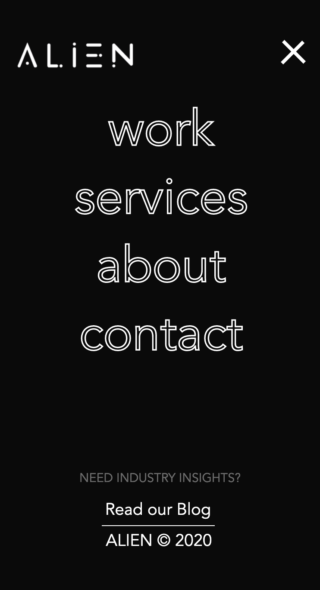
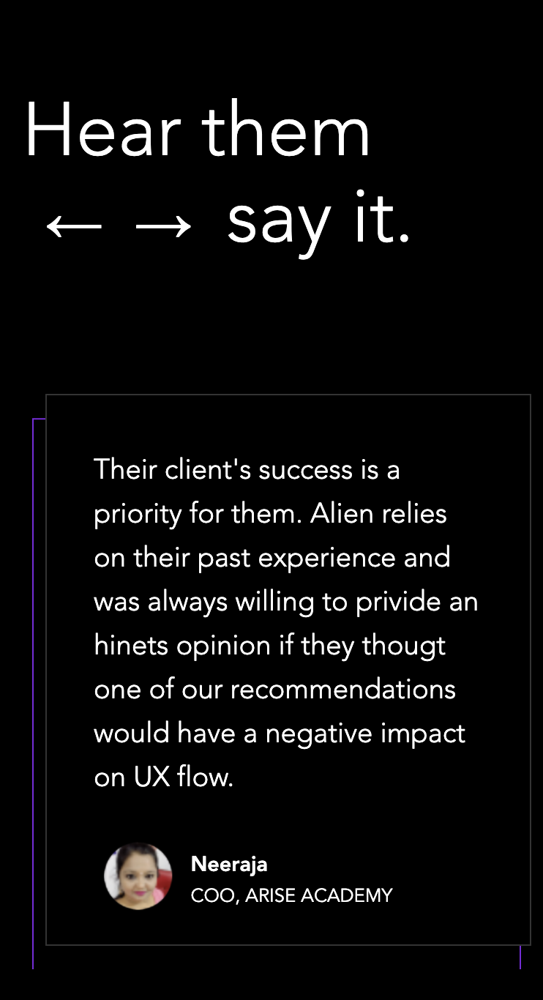

# Procesverslag
**Auteur:** -Bente Roelofsen-

Markdown cheat cheet: [Hulp bij het schrijven van Markdown](https://github.com/adam-p/markdown-here/wiki/Markdown-Cheatsheet). Nb. de standaardstructuur en de spartaanse opmaak zijn helemaal prima. Het gaat om de inhoud van je procesverslag. Besteedt de tijd voor pracht en praal aan je website.

## Bronnenlijst
1. -bron 1-
2. -bron 2-
3. -...-

## Eindgesprek (week 7/8)

-dit ging goed & dit was lastig-

**Screenshot(s):**

-screenshot(s) van je eindresultaat-

## Voortgang 3 (week 6)

-same as voortgang 1-

## Voortgang 2 (week 5)

### Stand van zaken

-Javascript werkt niet mee-

**Screenshot(s):**

-screenshot(s) van hoe ver je bent met korte uitleg-
-Ik heb alle html erin gezet. Ik ben verder gegaan met de styling. Ik ben hierbij vooral bezig geweest met de navigatie. -

### Agenda voor meeting

-samen met je groepje opstellen-

**Ian**

-Wilt meer uitleg over js-

**Joep**

-Wilt weten hoe je een website makkelijk responsive maakt.-

**Merel**

-Wilt graag weten in hoeverre het formulier moet werken-

**Bente**

-Ik wil graag hulp met js voor de 'slider'-
-Ik wil graag hulp bij de vekleuring van de achtergrond bij verschillende telefoonformaten- 

### Verslag van meeting

## Voortgang 1 (week 3)

### Stand van zaken

-Javascript werkte niet zoals geplant-

**Screenshot(s):**

-screenshot(s) van hoe ver je bent met korte uitleg-
- De achtergrond laat ik veranderen van zwart naar wit. Ik heb de summary's gestyld. -

### Agenda voor meeting

-samen met je groepje opstellen-

**Ian**

- Layout plaatjes met verschillende grote-

**Joep**

- Wilt weten hoe je een website makkelijk responsive maakt.-

**Merel**

- Hoe maak je een hamburger menu-

**Bente**

- Hoe plaats je dropdown icoon naast de summary.-
- Waarom werk mijn javascript niet?!?!-
- hoe gaat de andere summary dicht als er een andere summary wordt geopend-

### Verslag van meeting

-Wij hebben besproken hoe je een hamburger menu kan maken. Verder kan ik mijn javascript probleem oplossen in CSS. Ik moet voor de summary's aan de slag met een true en false statement in JS. Ik kan img naast de summary zetten.-

## Breakdownschets (week 1)

-uitwerken voor de 1e werkgroep - eind van de eerste week-

## Intake (week 1)
-uitwerken voor de kick-off werkgroep - begin van de eerste week-

**Je startniveau:** -blauw-

**Je focus:** -surface plane-

**Je opdracht:** -https://www.thealien.design-

**Screenshot(s) van de eerste pagina (small screen):**

**Screenshot(s) van de tweede pagina (small screen):**

