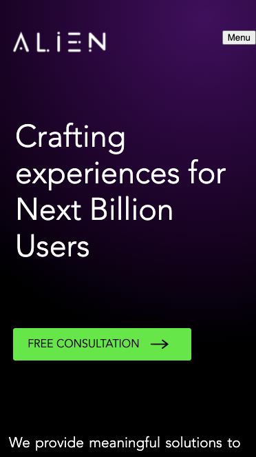
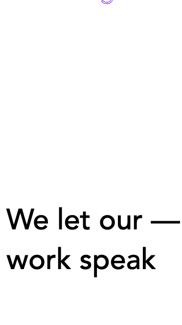
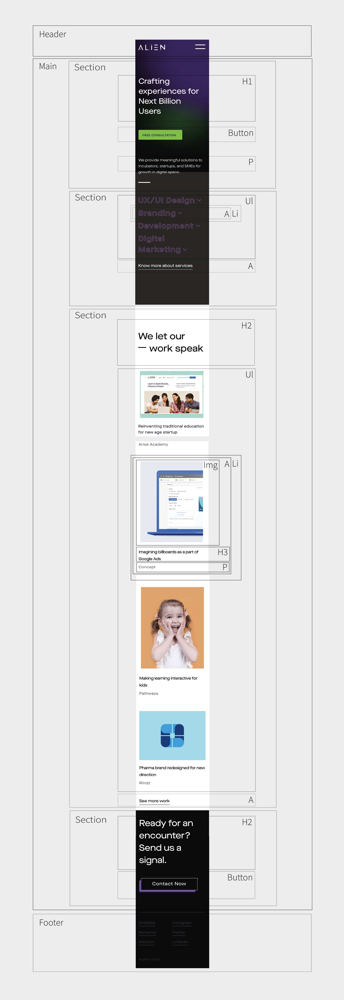
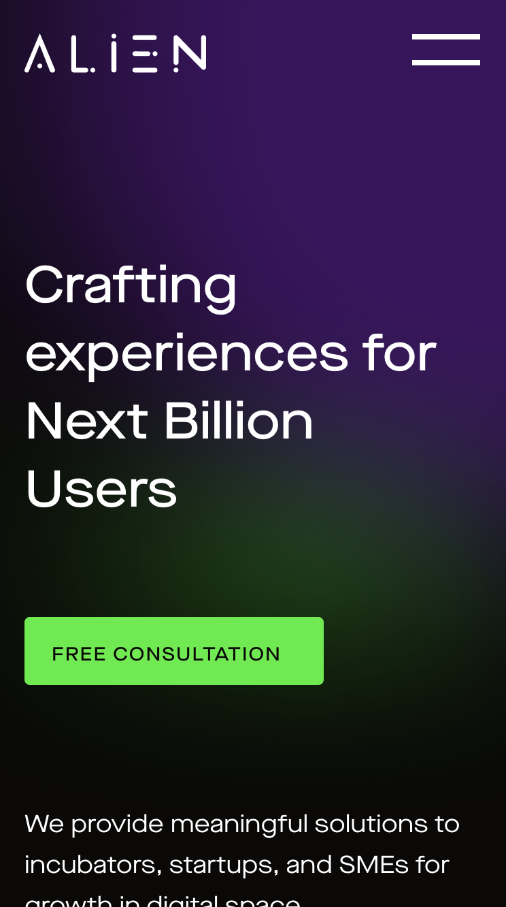
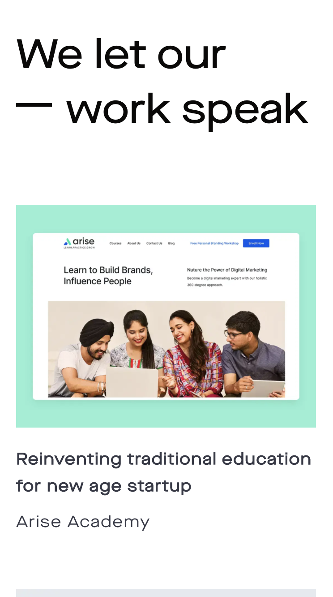

# Procesverslag
**Auteur:** -Bente Roelofsen-

Markdown cheat cheet: [Hulp bij het schrijven van Markdown](https://github.com/adam-p/markdown-here/wiki/Markdown-Cheatsheet). Nb. de standaardstructuur en de spartaanse opmaak zijn helemaal prima. Het gaat om de inhoud van je procesverslag. Besteedt de tijd voor pracht en praal aan je website.

## Bronnenlijst
1. -bron 1-
2. -bron 2-
3. -...-

## Eindgesprek (week 7/8)

-dit ging goed & dit was lastig-

**Screenshot(s):**

-screenshot(s) van je eindresultaat-

## Voortgang 3 (week 6)

-same as voortgang 1-

## Voortgang 2 (week 5)

-same as voortgang 1-

## Voortgang 1 (week 3)

### Stand van zaken

-Javascript werkte niet zoals geplant-

**Screenshot(s):**

-screenshot(s) van hoe ver je bent met korte uitleg-
- De achtergrond laat ik veranderen van zwart naar wit. Ik heb de summary's gestyld. -

### Agenda voor meeting

-samen met je groepje opstellen-

**Ian**

- Layout plaatjes met verschillende grote-

**Joep**

- Wilt weten hoe je een website makkelijk responsive maakt.-

**Merel**

- Hoe maak je een hamburger menu-

**Bente**

- Hoe plaats je dropdown icoon naast de summary.-
- Waarom werk mijn javascript niet?!?!-
- hoe gaat de andere summary dicht als er een andere summary wordt geopend-

### Verslag van meeting

-na afloop snel uitkomsten vastleggen-

## Breakdownschets (week 1)

-uitwerken voor de 1e werkgroep - eind van de eerste week-

## Intake (week 1)
-uitwerken voor de kick-off werkgroep - begin van de eerste week-

**Je startniveau:** -blauw-

**Je focus:** -surface plane-

**Je opdracht:** -https://www.thealien.design-

**Screenshot(s) van de eerste pagina (small screen):**

**Screenshot(s) van de tweede pagina (small screen):**

