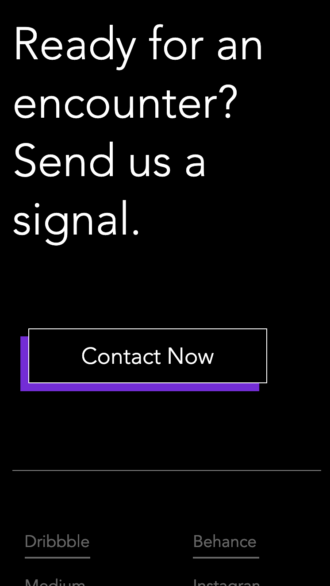
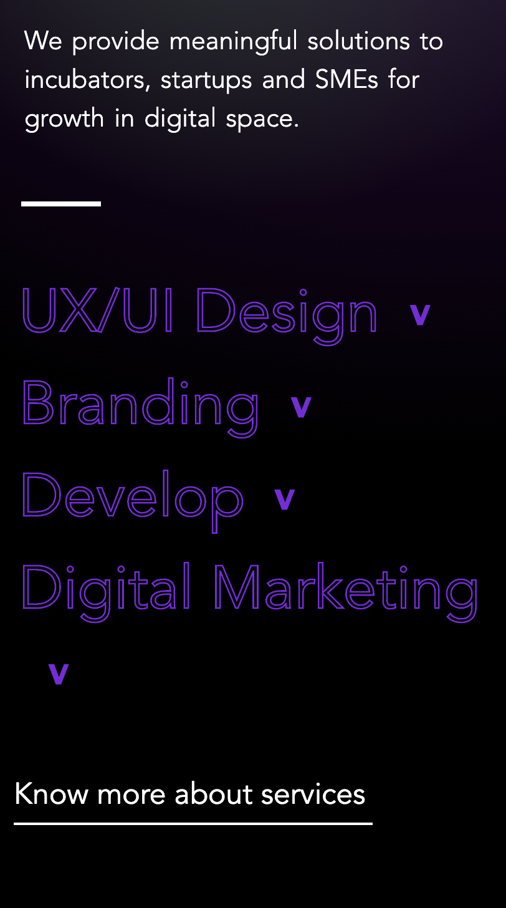
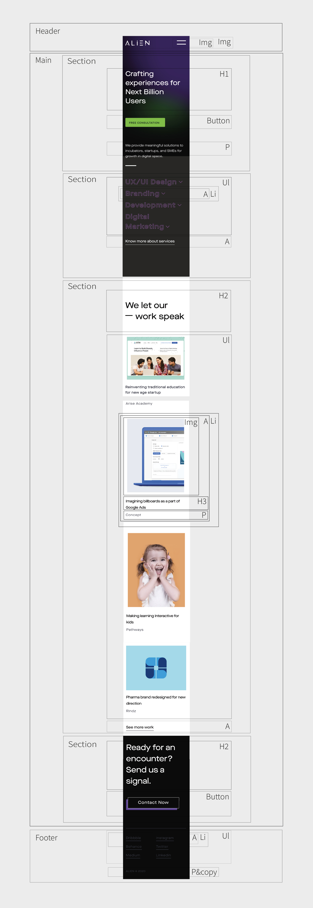

# Procesverslag
**Auteur:** -Bente Roelofsen-

Markdown cheat cheet: [Hulp bij het schrijven van Markdown](https://github.com/adam-p/markdown-here/wiki/Markdown-Cheatsheet). Nb. de standaardstructuur en de spartaanse opmaak zijn helemaal prima. Het gaat om de inhoud van je procesverslag. Besteedt de tijd voor pracht en praal aan je website.

## Bronnenlijst
1. -https://www.youtube.com/watch?v=z_vvY7YX3so-
2. -https://codepen.io/shooft/pen/zYqJLvZ-

## Eindgesprek (week 7/8)

-Ik was al erg ver dus hoefde alleen nog de tweede pagina te maken. Dat verliep redelijk oké. ik liep wel een paar keer tegen hetzelfde probleem aan; code klopt maar het werkt niet. Er zal vast een fout zijn geweest maar zover ik kan vinden niet. Zo werkt bijvoorbeeld de nav wel op de homepagina, maar niet op de Services pagina. Ik heb lang gezocht wat er fout was maar kon niks vinden. Verder stond er ook nergens een probleem gemeld die het verklaarde. Ik begrijp nog steeds niet waarom dit niet werkt, aangezien het een kwestie van kopiëren en plakken is. Daarnaast heb ik nog een probleem niet kunnen oplossen, het veranderen van de achtergrondkleur. De achtergrond verandert nu op basis van de hoogte van het scherm, wat dus verschilt per telefoon. Ik  moest dit daarom in section veranderen, omdat bepaalde elementen niet te lezen waren als het beeld te snel wit werd. Ik heb echter overal op internet gezocht en zelf wat geprobeerd in te vullen, maar zonder succes. Ik ben ook niet heel goed in Javascript dus heb het helaas niet op eigen kracht kunnen oplossen. Verder heb ik mijn code netjes gemaakt en states van de knoppen toegevoegd, zoals :focus en :active. Ondanks de paar puntjes die ik niet heb kunnen oplossen ben ik erg tevreden met het resultaat en hoop dat mijn site en mijn harde geploeter voor een voldoende zorgen. :)-

**Screenshot(s):**

-screenshot(s) van je eindresultaat-

## Voortgang 3 (week 6)

### Stand van zaken

- Ik heb deze week vrij weinig tijd gehad dus heb niet veel aangepast. Ik was echter al erg ver dus dit zorgt niet voor problemen. Ik heb de pijljes van de summary kunnen laten draaien.-

**Screenshot(s):**

-Ik had eerst problemen met het laten draaien van het pijltje. Ik dacht dat dit javascript moest, maar dit werkte niet. Dit bleek niet nodig te zijn. Tijdens de les is het probleem met css opgelost.-

-Ik heb alle html erin gezet. Ik ben verder gegaan met de styling. Ik ben hierbij vooral bezig geweest met de navigatie. Daarnaast heb ik een slider toegevoegd voor de quotes.-

### Agenda voor meeting

-samen met je groepje opstellen-

**Ian**

-Wilt meer uitleg over js-

**Joep**

-Wilt meer weten over javascript voor het uitklappen van het menu.-

**Merel**

-Wilt graag weten hoe de achtergrond foto weg gaat bij de contactpagina.-

**Bente**

-Ik wil weten hoe de true en false statement werkt.- 

### Verslag van meeting
-De problemen zijn opgelost. Ik heb met behulp van de docent de javascript geschreven waardoor maar één element tegelijk uitgeklapt kan zijn. De oplossing was heel anders dan ik had gedacht of al had geprobeerd. Ik begrijp nu wel de werking van de statement. Verder hadden we Joep even wat meer op weg geholpen, die was nog niet zo ver. Ook Merel was geholpen met de contactpagina en kon weer verder.- 

## Voortgang 2 (week 5)

### Stand van zaken

-Het ging allemaal best goed. Merk dat ik het steeds beter onder de knie heb. Vooral dingen op de juiste plek krijgen vond ik eerst lastig, maar gaat nu goed. Verder ben ik druk bezig geweest met slider en animaties. Dit verliep redelijk soepel. Ben tot nu toe erg blij met het resultaat.-

**Screenshot(s):**

-screenshot(s) van hoe ver je bent met korte uitleg-

-Ik heb alle html erin gezet. Ik ben verder gegaan met de styling. Ik ben hierbij vooral bezig geweest met de navigatie. Daarnaast heb ik een slider toegevoegd voor de quotes.-

### Agenda voor meeting

-samen met je groepje opstellen-

**Ian**

-Wilt meer uitleg over js-

**Joep**

-Wilt weten of je een ul in een ul kan zetten.-

**Merel**

-Wilt graag weten in hoeverre het formulier moet werken-

**Bente**

-Ik wil graag hulp bij de vekleuring van de achtergrond bij verschillende telefoonformaten.-
-Er is een paarse lijn verdwenen- 

### Verslag van meeting
-We hebben alle problemen behandeld en opgelost. Ik weet nu hoe ik verder moet met de vekleuring van de achtergrond. Ik moet in javascript niet gerbuiken van window maar van section om het responsive te maken. Verder was er een paarse lijn verdwenen doordat ik position:absolute had gebruikt. Nu heb ik het met margin gedaan en is ook dat probleem opgelost. Nadat ik heb aangepast hoef ik alleen de footer en summary's te stylen.- 

## Voortgang 1 (week 3)

### Stand van zaken

-Javascript werkte niet zoals geplant. Ik probeerde een pijltje te laten bewegen wanneer er over een knop werd gehoverd. Het linken van de elementen in javascript werkte niet.-

**Screenshot(s):**

-screenshot(s) van hoe ver je bent met korte uitleg-
- De achtergrond laat ik veranderen van zwart naar wit met hulp van Marvin. Ik heb de summary's gestyld. -

### Agenda voor meeting

-samen met je groepje opstellen-

**Ian**

- Layout plaatjes met verschillende grote-

**Joep**

- Wilt weten hoe je een website makkelijk responsive maakt.-

**Merel**

- Hoe maak je een hamburger menu-

**Bente**

- Hoe plaats je dropdown icoon naast de summary.-
- Waarom werk mijn javascript niet?!?!-
- hoe gaat de andere summary dicht als er een andere summary wordt geopend-

### Verslag van meeting

-Wij hebben besproken hoe je een hamburger menu kan maken. Verder kan ik mijn javascript probleem oplossen in CSS. Ik moet voor de summary's aan de slag met een true en false statement in JS. Ik kan img naast de summary zetten.-

## Breakdownschets (week 1)

-uitwerken voor de 1e werkgroep - eind van de eerste week-

## Intake (week 1)
-uitwerken voor de kick-off werkgroep - begin van de eerste week-

**Je startniveau:** -blauw-

**Je focus:** -surface plane-

**Je opdracht:** -https://www.thealien.design-

**Screenshot(s) van de eerste pagina (small screen):**

**Screenshot(s) van de tweede pagina (small screen):**

